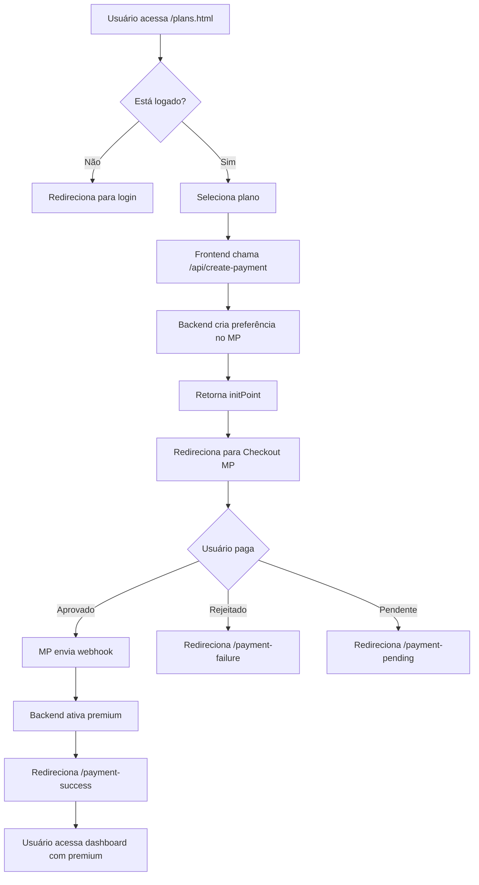

# 💳 Sistema de Pagamento Eternize v3

## 🎯 Visão Geral

Sistema completo de monetização SaaS integrado com **Mercado Pago** para o Eternize v3. Permite que usuários façam upgrade para planos premium e desbloqueiem recursos exclusivos.

**Status:** ✅ Pronto para produção  
**Integração:** Mercado Pago Checkout Pro  
**Hospedagem:** Vercel  
**URL:** https://eternize-v3.vercel.app

---

## 🚀 Implementação Completa

### ✅ O Que Foi Implementado

#### Backend (Node.js + Express)
- ✅ **Serviço Mercado Pago** (`server/services/mercadoPagoService.js`)
  - Criação de preferências de pagamento
  - Verificação de status de pagamento
  - Processamento de webhooks
  - Gerenciamento de assinaturas
  - Histórico de pagamentos

- ✅ **Rotas de Pagamento** (`server/routes/payment.js`)
  - `POST /api/create-payment` - Criar pagamento
  - `GET /api/payment-status/:paymentId` - Status do pagamento
  - `GET /api/payment-history/:userId` - Histórico
  - `POST /api/create-subscription` - Assinatura recorrente
  - `POST /api/cancel-subscription` - Cancelar assinatura

- ✅ **Rotas de Webhook** (`server/routes/webhook.js`)
  - `POST /api/webhook/mercadopago` - Receber notificações
  - `POST /api/webhook/test-webhook` - Testar ativação
  - `GET /api/webhook/check-premium/:userId` - Verificar status

#### Frontend (HTML + CSS + JavaScript)
- ✅ **Página de Planos** (`plans.html`)
  - 3 planos: Básico, Premium Mensal/Anual, Vitalício
  - Toggle mensal/anual com desconto
  - Comparação detalhada de recursos
  - FAQ integrado
  - Design responsivo

- ✅ **Sistema de Pagamento** (`js/payment.js`)
  - Integração com SDK Mercado Pago
  - Verificação de login
  - Criação de preferência
  - Redirecionamento para checkout
  - Processamento de retorno

- ✅ **Gerenciador de Recursos Premium** (`js/premium-features.js`)
  - Verificação de limites (eventos e fotos)
  - Badge premium no perfil
  - Modais de upgrade
  - Banner promocional
  - Bloqueio de recursos premium

- ✅ **Páginas de Retorno**
  - `payment-success.html` - Pagamento aprovado
  - `payment-failure.html` - Pagamento rejeitado
  - `payment-pending.html` - Pagamento pendente

#### Estilos
- ✅ **CSS dos Planos** (`css/plans.css`)
  - Design moderno SaaS
  - Animações suaves
  - Cards de planos com hover effects
  - Tabela de comparação
  - Totalmente responsivo

---

## 💎 Estrutura de Planos

### 🎯 Plano Básico (Gratuito)
```
Preço: R$ 0,00
Recursos:
  ✓ 1 evento ativo
  ✓ Até 50 fotos por evento
  ✓ QR Code padrão
  ✓ Galeria pública
  ✗ Personalização de QR
  ✗ Download de fotos
  ✗ Galeria privada
```

### 👑 Plano Premium Mensal
```
Preço: R$ 29,90/mês
Recursos:
  ✓ Eventos ilimitados
  ✓ Upload ilimitado de fotos
  ✓ QR Code personalizado
  ✓ Galeria privada
  ✓ Download de todas as fotos
  ✓ Temas exclusivos
  ✓ Suporte prioritário
  ✓ Sem marca d'água
```

### 👑 Plano Premium Anual
```
Preço: R$ 299,90/ano (R$ 24,99/mês)
Economia: R$ 59,90 (17% de desconto)
Recursos: Todos do Premium Mensal
```

### 💎 Plano Vitalício
```
Preço: R$ 497,00 (pagamento único)
Recursos:
  ✓ Todos do Premium
  ✓ Acesso vitalício
  ✓ Atualizações gratuitas
  ✓ Sem mensalidades
```

---

## 🔄 Fluxo de Pagamento



---

## 📁 Estrutura de Arquivos

```
eternize-v3/
├── server/
│   ├── services/
│   │   └── mercadoPagoService.js      # Lógica Mercado Pago
│   ├── routes/
│   │   ├── payment.js                 # Rotas de pagamento
│   │   └── webhook.js                 # Webhook handler
│   ├── api.js                         # Servidor principal
│   ├── package.json                   # Dependências (+ mercadopago)
│   └── .env.example                   # Variáveis de ambiente
│
├── js/
│   ├── payment.js                     # Sistema de pagamento frontend
│   └── premium-features.js            # Gerenciador de recursos premium
│
├── css/
│   └── plans.css                      # Estilos da página de planos
│
├── plans.html                         # Página de planos
├── payment-success.html               # Página de sucesso
├── payment-failure.html               # Página de falha
├── payment-pending.html               # Página de pendente
│
├── INTEGRACAO_MERCADOPAGO.md         # Documentação completa
├── QUICKSTART_PAGAMENTO.md           # Guia rápido
└── README_PAGAMENTO.md               # Este arquivo
```

---

## ⚙️ Configuração

### 1. Obter Credenciais Mercado Pago

1. Acesse: https://www.mercadopago.com.br/developers
2. Crie uma aplicação
3. Copie as credenciais:
   - **Teste:** `TEST-xxxx-xxxx-xxxx-xxxx`
   - **Produção:** `APP_USR-xxxx-xxxx-xxxx-xxxx`

### 2. Configurar Variáveis de Ambiente

Edite `server/.env`:

```bash
# Mercado Pago
MERCADO_PAGO_ACCESS_TOKEN=TEST-seu-token-aqui
MERCADO_PAGO_PUBLIC_KEY=TEST-sua-public-key-aqui

# Aplicação
APP_URL=http://localhost:3000
PORT=3000
NODE_ENV=development
```

### 3. Instalar Dependências

```bash
cd server
npm install
```

### 4. Iniciar Servidor

```bash
# Backend
cd server
npm start

# Frontend (outro terminal)
cd ..
npm run serve
```

### 5. Testar

Acesse: `http://localhost:8000/plans.html`

---

## 🧪 Testes

### Cartões de Teste Mercado Pago

| Status | Número do Cartão | Nome | CVV | Validade |
|--------|------------------|------|-----|----------|
| ✅ Aprovado | 5031 4332 1540 6351 | APRO | 123 | 11/25 |
| ❌ Rejeitado | 5031 4332 1540 6351 | OTHE | 123 | 11/25 |
| ⏳ Pendente | 5031 4332 1540 6351 | PEND | 123 | 11/25 |

### Testar Endpoints

```bash
# Criar pagamento
curl -X POST http://localhost:3000/api/create-payment \
  -H "Content-Type: application/json" \
  -d '{
    "plan": "premium-monthly",
    "userId": "test123",
    "userEmail": "test@example.com",
    "userName": "Test User"
  }'

# Ativar premium (teste)
curl -X POST http://localhost:3000/api/webhook/test-webhook \
  -H "Content-Type: application/json" \
  -d '{
    "userId": "test123",
    "action": "activate_premium"
  }'

# Verificar status premium
curl http://localhost:3000/api/webhook/check-premium/test123
```

---

## 🚀 Deploy em Produção

### Vercel

1. **Configurar Variáveis de Ambiente**
```bash
vercel env add MERCADO_PAGO_ACCESS_TOKEN
# Cole: APP_USR-seu-token-de-producao

vercel env add MERCADO_PAGO_PUBLIC_KEY
# Cole: APP_USR-sua-public-key-de-producao

vercel env add APP_URL
# Cole: https://eternize-v3.vercel.app
```

2. **Deploy**
```bash
vercel --prod
```

3. **Configurar Webhook no Mercado Pago**
- URL: `https://eternize-v3.vercel.app/api/webhook/mercadopago`
- Eventos: `payment.created`, `payment.updated`

---

## 🔒 Segurança

### Implementado
- ✅ Access Token apenas no backend
- ✅ Public Key apenas no frontend
- ✅ Validação de planos no backend
- ✅ Rate limiting em uploads
- ✅ Sanitização de inputs
- ✅ HTTPS obrigatório em produção

### Recomendações Adicionais
- [ ] Validar assinatura do webhook
- [ ] Implementar 2FA para admin
- [ ] Adicionar logs de auditoria
- [ ] Configurar alertas de fraude

---

## 💡 Estratégias de Monetização

### Conversão
1. **Trial Gratuito** - 7 dias de premium grátis
2. **Desconto Anual** - 17% de economia
3. **Urgência** - "Oferta por tempo limitado"
4. **Social Proof** - Depoimentos de clientes
5. **Upsell no Limite** - Modal quando atingir limite

### Retenção
1. **Onboarding** - Tutorial para novos premium
2. **Emails** - Lembretes de renovação
3. **Benefícios** - Novos recursos exclusivos
4. **Suporte** - Atendimento prioritário
5. **Comunidade** - Grupo VIP no Discord

### Expansão
1. **Plano Empresarial** - Para fotógrafos profissionais
2. **White Label** - Marca própria
3. **API Access** - Integração com outros sistemas
4. **Afiliados** - Programa de indicação

---

## 📊 Métricas Importantes

### KPIs de Negócio
- **MRR** (Monthly Recurring Revenue)
- **Churn Rate** (Taxa de cancelamento)
- **LTV** (Lifetime Value)
- **CAC** (Customer Acquisition Cost)
- **Taxa de Conversão** (Visitantes → Pagantes)

### KPIs Técnicos
- **Taxa de Aprovação** de pagamentos
- **Tempo de Ativação** do premium
- **Uptime** do sistema
- **Latência** das APIs
- **Taxa de Erro** em webhooks

---

## 🐛 Troubleshooting

### Webhook não recebe notificações
```bash
# Solução 1: Verificar URL no painel MP
# Solução 2: Testar com ngrok
ngrok http 3000
# URL: https://abc123.ngrok.io/api/webhook/mercadopago

# Solução 3: Verificar logs
tail -f server/logs/webhook.log
```

### Pagamento não ativa premium
```javascript
// Verificar logs do webhook
console.log('Webhook received:', req.body);

// Testar ativação manual
curl -X POST http://localhost:3000/api/webhook/test-webhook \
  -d '{"userId":"test123","action":"activate_premium"}'
```

### Erro ao criar preferência
```javascript
// Verificar credenciais
console.log('Access Token:', process.env.MERCADO_PAGO_ACCESS_TOKEN);

// Testar com curl
curl -X POST https://api.mercadopago.com/checkout/preferences \
  -H "Authorization: Bearer $MERCADO_PAGO_ACCESS_TOKEN" \
  -d '{"items":[{"title":"Test","unit_price":10,"quantity":1}]}'
```

---

## 📚 Documentação

- 📖 [Documentação Completa](INTEGRACAO_MERCADOPAGO.md)
- ⚡ [Quick Start](QUICKSTART_PAGAMENTO.md)
- 🔥 [Setup Firebase](DEPLOY_FIREBASE_SETUP.md)
- 🎯 [Sistema de Tokens](SISTEMA_TOKEN_COMPLETO.md)

---

## 📞 Suporte

### Mercado Pago
- 📖 [Documentação Oficial](https://www.mercadopago.com.br/developers)
- 💬 [Fórum de Desenvolvedores](https://www.mercadopago.com.br/developers/pt/support)
- 📧 Email: developers@mercadopago.com

### Eternize
- 📧 Email: dev@eternize.com.br
- 📱 WhatsApp: (31) 99999-9999
- 💬 Discord: https://discord.gg/eternize
- 🌐 Site: https://eternize.com.br

---

## ✅ Checklist de Produção

### Antes de Lançar
- [ ] Trocar credenciais de teste por produção
- [ ] Configurar webhook no Mercado Pago
- [ ] Testar fluxo completo em produção
- [ ] Configurar emails de confirmação
- [ ] Adicionar analytics (Google Analytics, Hotjar)
- [ ] Configurar monitoramento (Sentry, LogRocket)
- [ ] Testar em diferentes dispositivos
- [ ] Revisar textos e preços
- [ ] Preparar materiais de marketing
- [ ] Treinar equipe de suporte

### Pós-Lançamento
- [ ] Monitorar taxa de conversão
- [ ] Acompanhar feedback dos usuários
- [ ] Otimizar página de planos (A/B test)
- [ ] Implementar melhorias sugeridas
- [ ] Criar conteúdo educativo
- [ ] Expandir canais de aquisição

---

## 🎉 Resultado Final

### O Que Foi Entregue

✅ **Sistema de Pagamento Completo**
- Integração Mercado Pago funcionando
- 3 planos configurados (Básico, Premium, Vitalício)
- Webhooks processando pagamentos
- Ativação automática de premium

✅ **Frontend Profissional**
- Página de planos moderna
- Páginas de retorno (sucesso/falha/pendente)
- Sistema de verificação de limites
- Modais de upgrade

✅ **Backend Robusto**
- API RESTful completa
- Serviço Mercado Pago
- Gerenciamento de assinaturas
- Histórico de pagamentos

✅ **Documentação Completa**
- Guia de integração
- Quick start
- Troubleshooting
- Exemplos de código

✅ **Pronto para Produção**
- Segurança implementada
- Rate limiting configurado
- Variáveis de ambiente
- Deploy na Vercel

---

## 💰 Potencial de Receita

### Projeção Conservadora

**Cenário 1: 100 usuários premium/mês**
- 70 mensais (R$ 29,90) = R$ 2.093,00
- 20 anuais (R$ 299,90) = R$ 5.998,00
- 10 vitalícios (R$ 497,00) = R$ 4.970,00
- **Total mensal:** R$ 13.061,00
- **MRR:** R$ 7.091,00

**Cenário 2: 500 usuários premium/mês**
- 350 mensais = R$ 10.465,00
- 100 anuais = R$ 29.990,00
- 50 vitalícios = R$ 24.850,00
- **Total mensal:** R$ 65.305,00
- **MRR:** R$ 35.455,00

**Cenário 3: 1.000 usuários premium/mês**
- 700 mensais = R$ 20.930,00
- 200 anuais = R$ 59.980,00
- 100 vitalícios = R$ 49.700,00
- **Total mensal:** R$ 130.610,00
- **MRR:** R$ 70.910,00

---

**Sistema de Pagamento Eternize v3** ✅  
**Status:** Pronto para monetizar!  
**Integração:** Mercado Pago completa  
**Deploy:** Vercel otimizado  

*Transforme seu SaaS em uma máquina de receita recorrente! 💰*

---

*Desenvolvido com ❤️ pela equipe Eternize*