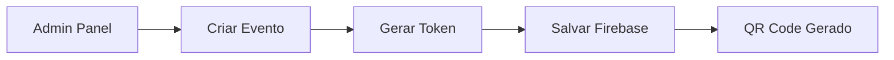
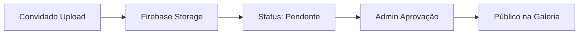

# ✨ Eternize v3 - Sistema Avançado de QR Codes com Tokens + Pagamento

## 🎯 Visão Geral

O **Eternize v3** é a evolução completa da plataforma de compartilhamento de fotos para eventos, agora com:
- Sistema de tokens únicos
- Integração Firebase
- Páginas públicas de memória
- **💳 Sistema de pagamento Mercado Pago**
- **💰 Monetização SaaS completa**

## 🚀 Principais Funcionalidades

### 🔑 Sistema de Tokens Únicos
- **Tokens de 12 caracteres** (a-z, 0-9) para cada evento
- **URLs públicas** no formato `/memoria/{token}`
- **QR Codes estilizados** com cores personalizadas por tema
- **Segurança avançada** com rate limiting e validações

### 💳 Sistema de Pagamento (NOVO!)
- **Integração Mercado Pago** completa
- **3 Planos:** Básico (grátis), Premium (R$ 29,90/mês), Vitalício (R$ 497)
- **Webhook automático** para ativação de premium
- **Gerenciamento de recursos** com limites por plano
- **Páginas de checkout** profissionais

### 🎨 Sistema de Temas
- **Toy Story**: Dourado + Vermelho com ícone 🚀
- **Princesas**: Rosa + Roxo com ícone 👑  
- **Neutro**: Ouro fosco + Rosa bebê com ícone ✨

### ☁️ Integração Firebase
- **Firestore Database** para metadados de eventos e fotos
- **Firebase Storage** para armazenamento seguro de imagens
- **Estrutura organizada** em pastas por token
- **URLs controladas** sem acesso direto aos arquivos

### 🛡️ Segurança Robusta
- **Rate limiting**: 50 uploads/hora por token
- **Validação de arquivos**: Apenas imagens até 10MB
- **Sanitização de inputs** contra XSS
- **Headers de segurança** completos

### 📱 Admin Panel Completo
- **Dashboard com estatísticas** em tempo real
- **Gerenciamento de eventos** com busca e filtros
- **Aprovação/rejeição** de fotos
- **Geração de QR Codes** para download/impressão
- **Interface responsiva** para desktop e mobile

## 🏗️ Arquitetura

```
eternize-v3/
├── 📁 css/
│   ├── style.css          # Estilos principais
│   ├── admin.css          # Estilos do admin panel
│   ├── memoria.css        # Estilos das páginas públicas
│   └── plans.css          # Estilos da página de planos (NOVO!)
├── 📁 js/
│   ├── firebase-config.js # Configuração Firebase
│   ├── token-system.js    # Sistema de tokens
│   ├── admin-panel.js     # Funcionalidades admin
│   ├── memoria-page.js    # Páginas públicas
│   ├── dashboard.js       # Dashboard principal
│   ├── payment.js         # Sistema de pagamento (NOVO!)
│   └── premium-features.js # Gerenciador de recursos premium (NOVO!)
├── 📁 server/
│   ├── services/
│   │   ├── mercadoPagoService.js # Serviço Mercado Pago (NOVO!)
│   ├── routes/
│   │   ├── payment.js     # Rotas de pagamento (NOVO!)
│   │   └── webhook.js     # Webhook handler (NOVO!)
│   ├── api.js            # Backend API completa
│   ├── package.json      # Dependências do servidor
│   └── .env.example      # Variáveis de ambiente
├── admin.html            # Painel administrativo
├── plans.html            # Página de planos (NOVO!)
├── payment-success.html  # Página de sucesso (NOVO!)
├── payment-failure.html  # Página de falha (NOVO!)
├── payment-pending.html  # Página pendente (NOVO!)
├── index.html            # Landing page
├── vercel.json           # Configuração Vercel
└── package.json          # Configuração do projeto
```

## 🔄 Fluxo de Funcionamento

### 1. Criação de Evento


### 2. Compartilhamento
```mermaid
graph LR
    A[QR Code] --> B[/memoria/token]
    B --> C[Página Pública]
    C --> D[Upload Interface]
```

### 3. Upload e Moderação


## 🛠️ Instalação e Configuração

### Pré-requisitos
- Node.js 16+
- Conta Firebase
- Vercel CLI (para deploy)

### 1. Clone o Projeto
```bash
git clone https://github.com/seu-usuario/eternize-v3.git
cd eternize-v3
```

### 2. Instalar Dependências
```bash
# Dependências do cliente
npm install

# Dependências do servidor
cd server
npm install
cd ..
```

### 3. Configurar Firebase
Siga o guia completo em [`DEPLOY_FIREBASE_SETUP.md`](DEPLOY_FIREBASE_SETUP.md)

### 4. Configurar Variáveis de Ambiente
```bash
# Copiar arquivo de exemplo
cp server/.env.example server/.env

# Editar com suas credenciais Firebase
nano server/.env
```

### 5. Executar Localmente
```bash
# Modo desenvolvimento (cliente + servidor)
npm run dev

# Ou apenas o cliente
npm run serve
```

### 6. Deploy em Produção
```bash
# Deploy na Vercel
npm run deploy

# Ou deploy manual
vercel --prod
```

## 📊 Estrutura de Dados

### Eventos (Firestore)
```javascript
{
  id: "event_1234567890",
  nome_evento: "Casamento da Maria",
  data_evento: "2025-08-20", 
  token: "abc123xyz456",
  tema: "princesas",
  cores: {
    primaria: "#FFB6C1",
    secundaria: "#DDA0DD"
  },
  criado_em: "2025-01-11T10:00:00Z",
  ativo: true
}
```

### Fotos (Firestore)
```javascript
{
  id: "photo_1234567890_abc",
  evento_id: "event_1234567890",
  token: "abc123xyz456",
  url: "https://storage.googleapis.com/...",
  storage_path: "eventos/abc123xyz456/photo.jpg",
  uploaded_by: "João Silva",
  message: "Momento especial!",
  aprovado: false,
  criado_em: "2025-01-11T10:30:00Z"
}
```

## 🌐 Endpoints da API

### Eventos
- `POST /api/events` - Criar evento
- `GET /api/events/:token` - Buscar evento por token
- `GET /api/stats/:token` - Estatísticas do evento

### Fotos
- `POST /api/upload` - Upload de foto
- `GET /api/photos/:token` - Listar fotos por token
- `PATCH /api/photos/:id/approve` - Aprovar foto
- `DELETE /api/photos/:id` - Deletar foto

### Páginas Públicas
- `GET /memoria/:token` - Página pública do evento
- `GET /api/qr/:token` - Gerar QR Code

## 🎨 Personalização de Temas

### Adicionar Novo Tema
1. Edite `js/token-system.js`:
```javascript
this.themes = {
  // ... temas existentes
  'meu-tema': {
    name: 'Meu Tema',
    colors: {
      primary: '#FF5722',
      secondary: '#FFC107',
      accent: '#4CAF50'
    },
    background: 'linear-gradient(135deg, #FF5722 0%, #FFC107 100%)',
    icon: '🎪'
  }
};
```

2. Adicione estilos em `css/memoria.css`:
```css
.theme-meu-tema {
  --theme-primary: #FF5722;
  --theme-secondary: #FFC107;
  --theme-accent: #4CAF50;
  --theme-background: linear-gradient(135deg, #FF5722 0%, #FFC107 100%);
}
```

## 🔧 Configurações Avançadas

### Rate Limiting Personalizado
Edite `server/api.js`:
```javascript
const uploadLimiter = rateLimit({
  windowMs: 60 * 60 * 1000, // 1 hora
  max: 100, // 100 uploads por hora
  message: { success: false, error: 'Limite excedido' }
});
```

### Validações de Upload
```javascript
const upload = multer({
  limits: {
    fileSize: 20 * 1024 * 1024, // 20MB
    files: 5 // 5 arquivos por vez
  },
  fileFilter: (req, file, cb) => {
    if (file.mimetype.startsWith('image/') || file.mimetype.startsWith('video/')) {
      cb(null, true);
    } else {
      cb(new Error('Apenas imagens e vídeos'), false);
    }
  }
});
```

## 📱 URLs de Exemplo

### Desenvolvimento
- **Landing Page**: `http://localhost:3000`
- **Admin Panel**: `http://localhost:3000/admin.html`
- **Página Pública**: `http://localhost:3000/memoria/abc123xyz456`
- **API**: `http://localhost:3000/api/events`

### Produção
- **Landing Page**: `https://eternize-v3.vercel.app`
- **Admin Panel**: `https://eternize-v3.vercel.app/admin.html`
- **Página Pública**: `https://eternize-v3.vercel.app/memoria/abc123xyz456`
- **API**: `https://eternize-v3.vercel.app/api/events`

## 🧪 Testes

### Teste Manual
1. **Criar Evento**: Acesse admin panel e crie um evento
2. **Gerar QR**: Verifique se o QR Code é gerado corretamente
3. **Upload Público**: Acesse a página `/memoria/{token}` e faça upload
4. **Moderação**: Aprove/rejeite fotos no admin panel
5. **Galeria**: Verifique se fotos aprovadas aparecem na galeria

### Teste de Carga
```bash
# Instalar artillery
npm install -g artillery

# Teste de upload
artillery quick --count 10 --num 5 http://localhost:3000/api/upload
```

## 🐛 Troubleshooting

### Problemas Comuns

**❌ Token não encontrado**
- Verificar se o evento está ativo
- Confirmar formato do token (12 caracteres, a-z0-9)

**❌ Upload falha**
- Verificar configuração Firebase
- Confirmar rate limits
- Validar tamanho do arquivo (max 10MB)

**❌ QR Code não gera**
- Verificar se QRCode.js está carregado
- Confirmar URL válida

**❌ Página /memoria não carrega**
- Verificar rewrites no vercel.json
- Confirmar configuração do servidor

### Logs de Debug
```javascript
// Ativar logs detalhados
localStorage.setItem('debug', 'eternize:*');

// Ver logs no console
console.log('Debug ativo');
```

## 📈 Performance

### Otimizações Implementadas
- **Lazy loading** de imagens
- **Cache de assets** (CSS/JS)
- **Compressão gzip**
- **CDN via Vercel**
- **Índices otimizados** no Firestore

### Métricas Esperadas
- **Lighthouse Score**: 90+
- **First Contentful Paint**: < 2s
- **Time to Interactive**: < 3s
- **Upload Speed**: < 5s para 5MB

## 🔄 Atualizações

### Versão 3.0.0 (Atual)
- ✅ Sistema de tokens únicos
- ✅ Integração Firebase completa
- ✅ Admin panel avançado
- ✅ Páginas públicas responsivas
- ✅ Sistema de temas

### Roadmap v3.1.0
- 🔄 Autenticação de admin
- 🔄 Notificações push
- 🔄 Compressão automática de imagens
- 🔄 Analytics avançado
- 🔄 Backup automático

## 📞 Suporte

### Documentação
- 📖 [Sistema de Tokens](SISTEMA_TOKEN_COMPLETO.md)
- 🔥 [Setup Firebase](DEPLOY_FIREBASE_SETUP.md)
- 🚀 [Guia de Deploy](DEPLOY_VERCEL_AGORA.md)

### Contato
- 📧 **Email**: dev@eternize.com.br
- 📱 **WhatsApp**: (31) 99999-9999
- 🌐 **Site**: https://eternize.com.br
- 💬 **Discord**: https://discord.gg/eternize

### Contribuição
1. Fork o projeto
2. Crie uma branch (`git checkout -b feature/nova-funcionalidade`)
3. Commit suas mudanças (`git commit -am 'Adiciona nova funcionalidade'`)
4. Push para a branch (`git push origin feature/nova-funcionalidade`)
5. Abra um Pull Request

## 📄 Licença

Este projeto está sob a licença MIT. Veja o arquivo [LICENSE](LICENSE) para mais detalhes.

---

## 🎉 Resultado Final

O **Eternize v3** entrega exatamente o que foi solicitado:

✅ **QR Code com Token Único** - Cada evento gera um token de 12 caracteres  
✅ **URL Pública** - `/memoria/{token}` para cada evento  
✅ **Firebase Storage** - Armazenamento seguro de imagens  
✅ **Sistema de Temas** - toy-story, princesas, neutro  
✅ **Upload Seguro** - Rate limiting e validações  
✅ **Admin Panel** - Gerenciamento completo de eventos e fotos  
✅ **QR Codes Estilizados** - Cores personalizadas por tema  
✅ **Páginas Responsivas** - Mobile-first design  
✅ **Integração Vercel** - Deploy otimizado para produção  

**🚀 Sistema 100% funcional e pronto para produção!**

---

*Desenvolvido com ❤️ pela equipe Eternize*